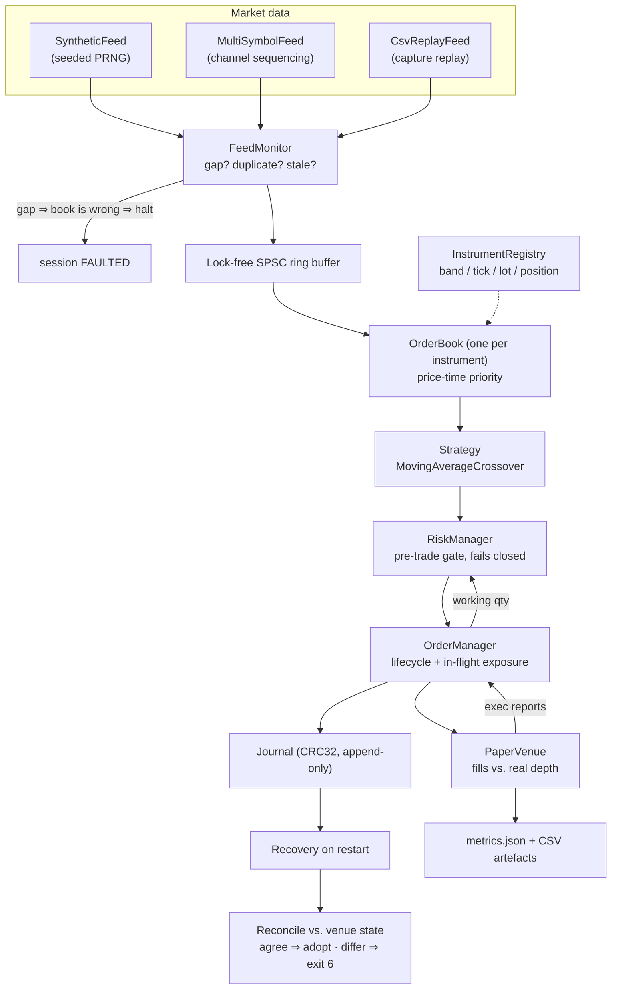

# high-frequency-trading

A low-latency limit-order-book trading engine in C++17, with an asyncio Python
research pipeline alongside it — both offline, deterministic, and reproducible
on any machine with a compiler.


---

## Why this matters

An electronic trading engine is one of the few pieces of software where being
*wrong* is more expensive than being *slow*. The venue keeps trading whether or
not your process is alive, whether or not your book is correct, and whether or
not you remember the orders you sent. Most "HFT demo" projects model the happy
path — a price arrives, a signal fires, a fill comes back — and quietly skip
every state a real system actually spends its incidents in.

This repository is built around those states:

- **A missed market-data message makes the book wrong, not stale.** The book is
  built by applying every message in order, so a missed add leaves phantom
  liquidity and a missed cancel leaves depth that is not there — permanently,
  because nothing later in the stream corrects it. The engine validates the
  session sequence and stops rather than quoting against a book it knows is
  broken.
- **Position is not exposure.** An engine that has fired 500 lots and had none
  come back is carrying 500 lots that no position-based limit can see, and will
  happily fire 500 more. Every risk limit here is checked against position *plus*
  working quantity.
- **A crash must not lose what you own.** Orders and execution reports are
  journalled before they can exist at the venue. On restart, recovery runs
  before anything can trade, and if the last session left orders that may still
  be live the engine **refuses to start** until it reconciles against what the
  venue says it holds.
- **Divergence from the venue is counted, not swallowed.** Unknown order ids,
  duplicate acks, illegal transitions and overfills are all reconciliation
  breaks, reported in `metrics.json`.

The performance work matters for the same reason the correctness work does: the
data structures used here (flat price-level arrays, hierarchical bitmaps,
intrusive FIFOs, a lock-free SPSC hand-off) are the ones production venues and
market makers actually use, and they are worth understanding structurally, not
as trivia.

**What is not real, stated plainly:** there is no exchange connectivity. There is
no FIX or binary order-entry session, no market-data snapshot channel to recover
from a gap, and no colocation. `PaperVenue` simulates fills against the live
book. The Python pipeline is backed by [yfinance](https://github.com/ranaroussi/yfinance),
an unofficial scraper with no SLA and no execution API — a prototyping tool, not
a feed. Benchmarks come from a general-purpose developer machine with no core
pinning, so they measure this code, not a trading system.

---

## Skills demonstrated

**Low-latency C++17**
- Lock-free single-producer/single-consumer ring buffer: acquire/release
  publication, cache-line padded indices to avoid false sharing, and cached
  copies of the peer index so the common-case push/pop touches no shared state
  (`cpp/include/hft/ring_buffer.hpp`).
- Cache-conscious limit order book: flat array of price levels (price → level is
  one subtraction), intrusive doubly-linked FIFOs for time priority, a slab
  allocator with a free list so add/cancel never allocate after warm-up, and a
  three-tier hierarchical bitmap giving O(1) best-bid/ask via count-leading-zeros
  (`cpp/include/hft/order_book.hpp`).
- Allocation-free hot paths throughout: OMS records in a slab, incremental
  per-symbol exposure, HdrHistogram-style bucketed latency recording, and an
  async logger that does no formatting or I/O on the tick path and drops rather
  than blocks.
- `rdtsc`-based microbenchmarking with TSC calibration and reported clock
  overhead, plus optimiser sink barriers (`cpp/bench/bench_main.cpp`).

**Systems / trading-systems engineering**
- CRC32-checksummed append-only journal with configurable sync policy
  (`on_write` / `interval` / `always`), torn-tail detection, and full state
  recovery.
- Startup reconciliation against venue-reported state, classifying breaks
  (`ORPHAN_AT_VENUE`, `MISSING_AT_VENUE`, `QUANTITY_MISMATCH`, `TERMS_MISMATCH`,
  `POSITION_MISMATCH`).
- Explicit order state machine, ack timeouts swept on a clock, and a fail-closed
  pre-trade risk gate with per-reason rejection accounting.
- Market-data session validation: sequence gaps, duplicate/reorder rejection,
  staleness watchdog.
- Signal-safe cooperative shutdown, distinct exit codes per failure class, and a
  config layer where an unknown key is a hard error.

**Build, test and tooling**
- Dual build systems (CMake and plain GNU Make) kept working in parallel, static
  runtime linking for MinGW, `-Wall -Wextra -Wpedantic -Werror`.
- 245 C++ unit tests under a ~90-line header-only harness, including a
  randomised **differential test** of the order book against an independently
  maintained shadow model, and journal tests driven by the states a real crash
  leaves behind (truncated mid-record, lost records, flipped bit, missing
  end-of-session marker).
- ASan / UBSan / TSan builds, plus a `hardened` configuration (UBSan trap mode +
  `_GLIBCXX_DEBUG` + `_GLIBCXX_ASSERTIONS` + stack protector) that needs no
  sanitizer runtime and therefore also works on MinGW.
- GitHub Actions matrix CI across Linux and Windows that asserts *operational*
  behaviour end to end: a gapped feed halts, an unclean restart is refused with
  exit code 6, an orphan order at the venue blocks startup, and a replay
  reproduces identical trading results.
- Multi-stage Docker builds that run the unit tests during the image build, drop
  to a non-root user, and set `STOPSIGNAL SIGTERM` so the engine can checkpoint.

**Python**
- `asyncio` pipeline (ingest task, engine task, periodic summary task) with an
  async ring buffer, `abc` interfaces, frozen slotted dataclasses and typing.
- Nanosecond stage-boundary latency instrumentation with percentile summaries
  and CSV dumps.
- Prometheus instrumentation on a dedicated registry with deliberately bounded
  label cardinality, plus a provisioned Prometheus + Grafana stack.
- `pytest` / `pytest-asyncio` suite that mocks `yfinance` entirely — no test
  makes a network call.
- Notebook generation and execution automated with `nbformat` / `nbclient` so
  the committed notebook has real outputs.

---

## Architecture



Every stage sits behind an interface — `MarketDataSource`, `ExecutionVenue`,
`Strategy`, `BookProvider` — so a real feed or broker drops in without touching
anything downstream.

### The models

| Model | Where | What it does |
|---|---|---|
| **Order-flow model** (synthetic) | `cpp/src/feed.cpp` | Deterministic seeded PRNG generating a quiet-equity-book mix: ~70% passive adds near the touch, ~22% cancels of previously added orders, ~8% aggressive marketable orders, around a fair value that random-walks ±1 tick. Same seed ⇒ byte-identical stream. |
| **Replay model** | `CsvReplayFeed` | Replays a captured CSV (`symbol,type,side,price,quantity,order_id,source_ts_ns,sequence`) so a strategy can be regression-tested against a known episode. |
| **Book / data model** | `order_book.hpp` | Price-time priority limit order book over a fixed price band. Flat level array + intrusive FIFO per level + three-tier bitmap. |
| **Instrument model** | `instrument.hpp` | Per-instrument price band, tick size, lot size and position ceiling. Book messages violating the contract are rejected; the engine's own orders are snapped onto the tick/lot grid. A per-instrument limit may only tighten the global one. |
| **Signal / alpha model** | `strategy.hpp`, `hft/core/strategy.py` | Moving-average crossover: a signal fires only when the fast mean crosses the slow mean (the first computed state never fires). The C++ port maintains both averages as running sums over a fixed ring, so `on_tick` is O(1) regardless of window size — the Python version's `sum()` is O(slow_window). Signals are identical, and tested to be. It is a placeholder that exercises the pipeline, not alpha. |
| **Risk model** | `risk.hpp` | Pre-trade gate ordered cheapest-and-most-fatal-first: kill switch, order validity, fat-finger quantity, fat-finger notional, price collar (bps from reference), per-symbol inventory, gross inventory, order-rate throttle, daily order cap, peak-to-trough drawdown. Fails closed; every rejection is counted by reason. |
| **Order lifecycle model** | `oms.hpp` | Explicit state machine `PendingNew → New → PartiallyFilled → {Filled, Cancelled, Rejected, Expired}`. Supplies `working_quantity()` to the risk gate and counts every report that does not fit as a reconciliation break. |
| **Execution / fill model** | `execution.hpp`, `hft/execution/paper.py` | `PaperVenue`. With `cross_book = true` a marketable order is matched against its own instrument's resting depth and filled at the volume-weighted price actually obtained; otherwise it falls back to `reference_price ± slippage_bps`. Fees are `fee_bps` of notional. P&L uses an average-cost basis, realized on the closing portion — accounting deliberately identical to `paper.py` so both sides agree to the cent. |
| **Feed-health model** | `feed_health.hpp` | Channel-level sequence validation, tolerated-gap allowance, duplicate/reorder rejection, and a staleness watchdog (`feed_stale_ms`, disabled by default because the right threshold is instrument-specific). |
| **Latency model** | `latency.hpp`, `hft/metrics/timing.py` | Stage-boundary timestamps recorded into fixed buckets (C++) or samples with percentile summaries (Python). Allocation-free on the record path. |

### Layout

```
cpp/                          the C++17 engine
  include/hft/ , src/
    engine.*        feed -> ring -> book -> strategy -> risk -> OMS -> venue
    feed.*          SyntheticFeed / MultiSymbolFeed / CsvReplayFeed
    feed_health.*   sequence, duplicate and staleness validation
    order_book.*    price-time-priority book (flat array + bitmap + FIFO)
    instrument.*    per-instrument band, tick, lot, position ceiling
    strategy.*      Strategy interface + MovingAverageCrossover
    risk.*          pre-trade gate, reject reasons, halt reasons
    oms.*           order state machine, in-flight exposure, timeouts
    execution.*     ExecutionVenue interface + PaperVenue + BookProvider
    journal.*       CRC32 append-only journal, recovery
    reconcile.*     venue-state comparison and break classification
    ring_buffer.hpp lock-free SPSC queue
    latency.*       bucketed latency recorder
    log.*           async logger (no I/O on the tick path)
    metrics.*       end-of-run metrics.json + CSV writers
    config.*        key=value config, unknown key is a hard error
    main.cpp        CLI, signal handling, exit codes
  tests/            245 unit tests + header-only harness
  bench/            rdtsc microbenchmarks + end-to-end pipeline latency
  config/           engine.conf, the documented reference configuration
  CMakeLists.txt · Makefile · Dockerfile

hft/                          the Python research pipeline
  main.py           asyncio wiring + CLI
  config.py         dataclass config
  core/             ringbuffer.py, strategy.py, engine.py
  data/             base.py (MarketDataSource, Tick), yfinance_source.py
  execution/        base.py (ExecutionVenue, Order, Fill), paper.py
  metrics/          timing.py (LatencyRecorder), prom.py (Prometheus surface)

tests/              pytest suite for the Python pipeline (yfinance mocked)
scripts/            build_demo_notebook.py — generates + executes the notebook
notebooks/          demo.ipynb, committed with real outputs
monitoring/         docker-compose Prometheus + Grafana, provisioned from files
.github/workflows/  CI: builds, sanitizers, and end-to-end behaviour assertions
RUNBOOK.md          operations: halts, crash recovery, metrics to alarm on
```

---

## How it works

**1. A message arrives.** A `MarketDataSource` produces a `Tick` and stamps
`ingest_ts_ns` itself, so measured latency covers everything after receipt. The
synthetic feed generates adds, cancels and aggressive orders from a seeded PRNG;
the multi-symbol feed interleaves several instruments and assigns sequence
numbers at the *channel* level, the way a real venue does, so a gap is detectable
without reasoning about which symbol was due next.

**2. The session is validated.** `FeedMonitor` checks the sequence before the
message can reach the book. A duplicate is dropped (arbitrated A/B feeds deliver
everything twice by design). A gap beyond `feed_tolerated_gap` faults the session
and stops trading — the correct response is to re-synchronise from a snapshot,
and with no snapshot channel the engine does the honest half. Silence beyond
`feed_stale_ms` does the same.

**3. It crosses to the consumer.** In threaded mode the feed runs on its own
thread and hands ticks over through the lock-free SPSC ring buffer; a full ring
drops the newest tick and counts it rather than stalling ingestion. `--inline`
runs everything on one thread, which is the honest mode for benchmarking the
pipeline without cross-core hand-off noise.

**4. The book is updated.** The tick is routed to its instrument's `OrderBook`
after the instrument contract check (price inside the band, on the tick grid;
quantity on the lot grid). Adds insert at the tail of the price level's FIFO,
cancels unlink in O(1), and aggressive orders match against the opposite side in
price-time order. Best bid/ask stays O(1) through the level bitmap.

**5. The strategy runs.** `Strategy::on_tick` receives the tick and a reference
price (the book's view of fair value) and either returns nothing or emits a
`Signal` with a side. The crossover updates its running fast/slow sums and fires
only on a transition.

**6. Risk decides.** `RiskManager::check()` evaluates the intended order against
every limit, using position **plus** the OMS's working quantity as exposure.
Anything it cannot evaluate is a rejection. Each rejection is counted by reason.
A drawdown breach or daily-order breach engages the sticky kill switch.

**7. The order is registered and journalled.** The OMS assigns a dense client
order id and moves the order to `PendingNew`. If there is no free slot
(`max_open_orders`), the order is **not sent** — an order that cannot be tracked
cannot be cancelled or reconciled. With a journal configured, the order is
written before it can exist at the venue.

**8. The venue fills it.** `PaperVenue` crosses the order against the resting
depth in its own instrument's book and returns the volume-weighted fill price,
or falls back to `reference_price ± slippage_bps` when no book is available. The
execution report flows back into the OMS, which transitions the order and
updates exposure; anything that does not fit the state machine is counted as a
reconciliation break. Position, average cost, realized P&L, fees and the equity
curve are updated, and the fill is journalled.

**9. Nothing is left hanging.** A sweep runs on a clock (`order_sweep_ms`),
expiring orders past `ack_timeout_ms` — with `halt_on_order_timeout` on (the
default), that also halts, because an order whose state at the venue is unknown
is exposure that cannot be bounded.

**10. Shutdown, or a crash.** A clean stop drains the ring, flattens inventory if
`flatten_on_exit` is set (deliberately bypassing the pre-trade gate — otherwise
the limit that halted you would block the exit), checkpoints, writes an fsynced
end-of-session marker, then writes `metrics.json` and the CSVs. Without that
marker, the next start replays the journal, finds an unclean shutdown or live
orders, and exits **6** until an operator reconciles — at which point agreeing
orders are *adopted* into the OMS before the first tick, so they count toward
every limit.

The Python pipeline runs the same shape at research scale and without a book:
`YFinanceSource` polls `fast_info` with jittered backoff → async `RingBuffer` →
`StrategyEngine` drains it and runs the same crossover → `PaperExecutionVenue`
fills at the reference price with slippage and fees, while `LatencyRecorder`
captures stage boundaries and (optionally) feeds the Prometheus histograms.

---

## How to run

### Prerequisites

- **C++ engine:** a C++17 compiler (`g++`/`clang++`/MSVC) and either GNU Make or
  CMake ≥ 3.16. No third-party libraries, no network access.
- **Python pipeline:** Python ≥ 3.11.
- **Optional:** Docker (engine image, pipeline image, monitoring stack).

### Build and run the engine

```bash
cd cpp
make                      # engine, tests and benchmarks
mkdir -p out
./build/hft_engine --events 2000000 --out-dir out
```

Or with CMake:

```bash
cmake -S cpp -B cpp/build -DCMAKE_BUILD_TYPE=Release
cmake --build cpp/build --parallel
ctest --test-dir cpp/build --output-on-failure
```

CMake options: `-DHFT_STATIC_RUNTIME=ON` (default; links libstdc++/libgcc
statically, which on MinGW removes the DLL lookup at runtime) and
`-DHFT_NATIVE_ARCH=ON` (`-march=native`, faster but not portable).

### Useful invocations

```bash
# Three instruments, each with its own book, band and tick grid.
#   instrument = SYMBOL:min_price:max_price[:tick_size[:lot_size[:max_position]]]
./build/hft_engine --set instrument=AAPL:15000:30000 \
                   --set instrument=ESZ5:400000:410000:25:1:250 \
                   --set instrument=PENNY:100:900

# Durability on, so a crash is recoverable.
./build/hft_engine --journal out/engine.jrn --out-dir out

# Ask a journal what the last session left behind.
./build/hft_engine --recover out/engine.jrn

# Restart after a crash, reconciling against what the venue reports it holds.
./build/hft_engine --journal out/engine.jrn --venue-state out/venue.txt

# Capture a replay file, then replay it deterministically.
./build/hft_engine --write-replay out/replay.csv --replay-events 200000
./build/hft_engine --replay out/replay.csv

# Single-threaded (no ring hand-off), for clean pipeline measurement.
./build/hft_engine --inline --events 500000

# Every setting, and the effective config after files and flags are merged.
./build/hft_engine --list-settings
./build/hft_engine --config config/engine.conf --print-config
./build/hft_engine --help
```

A synthetic run replays hours of order flow in under a second, so the realistic
`max_orders_per_second = 1000` throttle rejects most orders in a demo. Raise it
when benchmarking (`--set max_orders_per_second=100000000`), keep it realistic
when operating.

### Configuration

`cpp/config/engine.conf` is the documented reference configuration: `key = value`,
one per line, `#` for comments. CLI `--set KEY=VALUE` is applied *after* the file
and wins. **An unknown or malformed key is a hard error**, not a warning — a
typo'd `max_postion_per_symbol` that silently leaves the real limit at its
default is exactly the failure the config layer exists to prevent. `instrument`
is the one key that accumulates rather than overwrites.

Key groups: market data (`symbol`, `events`, `seed`, `replay_path`), instruments,
strategy (`fast_window`, `slow_window`, `order_quantity`), book (`min_price`,
`max_price`, `ring_capacity`), venue (`slippage_bps`, `fee_bps`, `cross_book`),
risk, order management (`max_open_orders`, `ack_timeout_ms`, `order_sweep_ms`,
`halt_on_order_timeout`), feed health, durability (`journal_path`,
`journal_sync`, `allow_unclean_start`, `venue_state_path`) and ops (`threaded`,
`out_dir`, `log_level`, `flatten_on_exit`). Run `--list-settings` for the
complete list.

### Exit codes

| Code | Meaning |
|---|---|
| 0 | Success |
| 2 | Bad command line |
| 3 | Bad configuration |
| 4 | I/O failure (could not write artefacts, unreadable journal) |
| 5 | Runtime fault |
| 6 | **The previous session left state needing reconciliation.** Do not restart blindly — see [RUNBOOK.md](RUNBOOK.md). |

### Artefacts

`--out-dir` (the directory must already exist) receives `metrics.json`
(throughput, P&L, per-reason reject breakdown, feed health, order lifecycle,
latency percentiles), `latency_summary.csv`, `latency_histogram.csv`,
`fills.csv` and `book_snapshot.csv`.

### Tests and sanitizers

```bash
cd cpp
make test          # 245 unit tests
make hardened      # UBSan trap mode + _GLIBCXX_DEBUG (works on MinGW)
make asan          # ASan + UBSan (Linux; MinGW ships no sanitizer runtime)
make ubsan
make tsan
```

### Benchmarks

```bash
cd cpp
mkdir -p out
make bench                      # builds and runs
./build/hft_bench --out-dir out # writes bench_results.csv
```

Numbers come from one developer machine with no core pinning and are not
publishable figures — the benchmark exists to catch regressions and to show
which stage actually dominates. Measure before optimising.

### Docker (engine)

```bash
docker build -t hft-engine cpp/
docker run --rm -v "$PWD/out:/app/out" -v hft-journal:/var/lib/hft hft-engine \
  --journal /var/lib/hft/engine.jrn --out-dir /app/out
```

The image builds with `-Werror` and runs the unit tests as part of the build, so
an image that fails its own tests never gets created. It runs as a non-root user
and sets `STOPSIGNAL SIGTERM` so the engine can checkpoint on stop. Keep the
journal on a volume — a journal inside the container layer dies with the
container, which defeats the point of having one.

### Python research pipeline

```bash
pip install -r requirements.txt
python -m hft.main --symbols AAPL MSFT --poll-interval 2
pytest -q
```

CLI flags: `--symbols`, `--poll-interval`, `--fast-window`, `--slow-window`,
`--summary-interval`, `--latency-csv`, `--metrics`, `--metrics-port`.

### Monitoring (Python pipeline)

```bash
cd monitoring && docker compose up -d
python -m hft.main --metrics --symbols AAPL MSFT --poll-interval 2
```

- Grafana: <http://localhost:3002> (admin / admin), dashboard provisioned from
  `monitoring/grafana/dashboards/`
- Prometheus: <http://localhost:9091>
- Exporter: <http://localhost:9101/metrics>

The pipeline runs on the host, not in Compose; the stack only observes it. The
C++ engine is deliberately absent from the scrape config — it writes an
end-of-run JSON report, not a live endpoint.

### Environment variables

| Variable | Effect |
|---|---|
| `HFT_METRICS` | `1`/`true`/`yes`/`on` enables the Prometheus exporter (same as `--metrics`) |
| `HFT_METRICS_PORT` | Exporter port (default `9101`; `--metrics-port` overrides) |

### Docker (Python pipeline)

```bash
docker build -t hft-pipeline .
docker run --rm -p 9101:9101 -e HFT_METRICS=1 hft-pipeline --symbols AAPL MSFT
```

### Notebook

```bash
pip install -r requirements-notebook.txt
python scripts/build_demo_notebook.py     # regenerates and executes demo.ipynb
```

`notebooks/demo.ipynb` is committed with real outputs: live tick ingestion, the
ring buffer → engine → paper venue path, latency percentiles, and a
price/moving-average/signal chart.

---

## Operations

[RUNBOOK.md](RUNBOOK.md) covers startup, what each halt means, how to recover
from a crash, how to build and pass a venue-state file, and which metrics to
alarm on.

## What it would take to trade real money

Honestly stated, in order:

1. **Exchange connectivity.** A binary or FIX order-entry session with
   heartbeats, cancel-on-disconnect and sequence recovery. `ExecutionVenue` is
   the seam; nothing above it changes.
2. **A market-data snapshot channel.** Today a gap halts the engine because
   there is no way to rebuild the book. With snapshot recovery it could
   re-synchronise and carry on.
3. **A live order-status query.** Startup reconciliation exists and gates the
   restart, but with no order-entry session the venue's side has to be handed in
   as a file. With connectivity it becomes an order-status request and the same
   comparison runs unchanged.
4. **A real strategy.** The moving-average crossover is a placeholder that
   exists to exercise the pipeline.
5. **Hardware and tuning.** Core pinning, isolated CPUs, huge pages, kernel
   bypass — only after the `LatencyRecorder` output says where the time actually
   goes.
